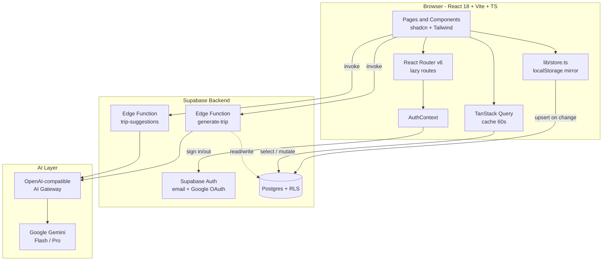
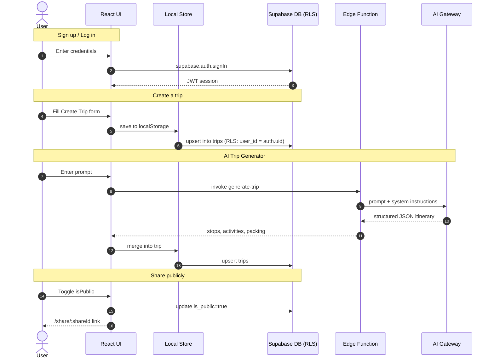

# 🌍 Traveloop — Personalized Travel Planning Made Easy

> Cinematic, intelligent, and collaborative travel planning. Dream it, design it, share it.

---

## 📸 Screenshots

> Drop PNGs into `docs/screenshots/` with these filenames to populate the grid.

| Landing | Dashboard |
|---|---|
|  |  |

| Create Trip | Itinerary Builder |
|---|---|
|  |  |

| AI Trip Generator | Admin Panel |
|---|---|
|  |  |

---

## ✨ Vision

Traveloop is a personalized, intelligent, and collaborative platform that transforms the way individuals plan and experience travel. We empower users to **dream, design, and organize trips** with ease — combining flexibility, interactivity, and beautiful design so that planning a trip feels as exciting as the trip itself.

## 🎯 Mission

Build a user-centric, responsive application that simplifies multi-city travel planning by giving travelers intuitive tools to:

- Add and manage travel stops and durations
- Explore cities and activities of interest
- Estimate trip budgets automatically
- Visualize timelines and day-wise plans
- Share trip plans publicly or with friends

## 🧩 Problem Statement

Design and develop a complete travel planning application where users can create customized **multi-city itineraries**, assign **dates, activities and budgets**, discover destinations, see **cost breakdowns and visual calendars**, and share their plans publicly or with friends. The system uses a relational database to store complex travel data and provides dynamic UIs that adapt to each user's flow.

---

## 🚀 Features

| # | Feature | Description |
|---|---------|-------------|
| 1 | **Login / Signup** | Email + password auth, Google OAuth, validation. |
| 2 | **Dashboard** | Welcome hub with recent trips, recommended cities, budget highlights. |
| 3 | **Create Trip** | Name, dates, description, optional cover photo, budget in ₹ INR. |
| 4 | **My Trips** | Cards with destination count, date range, edit/view/delete. |
| 5 | **Itinerary Builder** | Add stops, pick cities, assign dates and activities, reorder cities. |
| 6 | **Itinerary View** | Day-wise visual itinerary with activity blocks, time, and cost. |
| 7 | **City Search** | Curated catalog of famous **Indian cities** with photos and filters. |
| 8 | **Activity Search** | Browse activities by type, cost, duration. |
| 9 | **Budget & Cost Breakdown** | Auto-calculated costs (stay, meals, transport, activities) with charts. |
| 10 | **Packing Checklist** | Categorized checklist with packed status. |
| 11 | **Public / Shared Itinerary** | Read-only public link, copy-trip option, social sharing. |
| 12 | **Friends & Invites** | Token-based collaboration on trips. |
| 13 | **Profile / Settings** | Editable profile, language, saved destinations, account deletion. |
| 14 | **Trip Notes / Journal** | Timestamped notes per trip or per day. |
| 15 | **🤖 AI Trip Generator** | Describe your vibe → fully-built itinerary in seconds. |
| 16 | **🧠 Real-time Suggestions** | Destination-aware packing tips and local recommendations. |
| 17 | **💱 Multi-currency** | Live FX rates; default INR with switcher. |
| 18 | **🛡️ Admin Panel** | Analytics, user management, subscriptions, trip moderation. |

---

## 🛠️ Tech Stack

**Frontend**
- ⚛️ React 18 + TypeScript 5
- ⚡ Vite 5 (code-splitting, manual vendor chunks, lazy routes)
- 🎨 Tailwind CSS v3 + custom HSL design tokens
- 🧱 shadcn/ui + Radix UI primitives
- 🔀 React Router v6
- 🔄 TanStack Query
- 🎭 Lucide Icons

**Backend (Supabase)**
- 🗄️ PostgreSQL with Row-Level Security (RLS)
- 🔐 Supabase Auth (email/password + Google OAuth)
- ⚡ Edge Functions (Deno)
- 📦 Storage for trip cover photos
- 🔔 Realtime subscriptions

**AI**
- 🤖 OpenAI-compatible AI gateway (configurable via env vars)
- Default model: Google Gemini Flash
- Edge functions: `generate-trip`, `trip-suggestions`

**Tooling**
- ESLint, Vitest, Husky pre-commit hooks
- GitHub Actions for typecheck CI

---

## 🧰 Use Case → Technology Used

| Use Case / Feature | Technology Used |
|---|---|
| Authentication (email + Google OAuth) | Supabase Auth + `AuthContext` |
| Role-based admin panel | `user_roles` table + `has_role()` SECURITY DEFINER + RLS |
| Multi-city itinerary builder | React state + `lib/store.ts` + cloud sync to `trips` |
| Cloud trip persistence & cross-device sync | Supabase Postgres `trips` table (JSONB payload) |
| Public / shared trip view | `shareId` field + RLS read policy + `/share/:id` route |
| Friends & invites | Token-based invites stored on trip JSON, accepted via `/invite/:token` |
| AI Trip Generator | Edge function `generate-trip` → OpenAI-compatible gateway |
| Real-time suggestions | Edge function `trip-suggestions` (SSE streaming) |
| Multi-currency conversion | `lib/currency.ts` + open.er-api.com live FX (24 h cached) |
| Budget breakdown + charts | Pure TS `tripCost()` + Recharts |
| Cinematic UI | Tailwind v3 + HSL design tokens + Radix / shadcn primitives |
| Routing + lazy loading | React Router v6 + `React.lazy` + `Suspense` |
| Server state caching | TanStack Query (60 s stale, no focus refetch) |
| Offline-first behavior | LocalStorage mirror in `lib/store.ts` + cloud upsert on change |
| Type safety end-to-end | TypeScript 5 + auto-generated `supabase/types.ts` |

---

## 🏛️ Architecture



> Source: [`docs/architecture.mmd`](docs/architecture.mmd)

---

## 🔄 Data Flow (key user journeys)



> Source: [`docs/data-flow.mmd`](docs/data-flow.mmd)

---

## 📁 Project Structure

```
src/
├── components/         # Reusable UI (shadcn + custom)
│   ├── ui/             # shadcn primitives
│   ├── HeroSlider.tsx
│   ├── TripSuggestions.tsx
│   ├── AiTripGenerator.tsx
│   └── ...
├── contexts/           # React contexts (AuthContext)
├── hooks/              # Custom hooks (use-trips, use-toast)
├── integrations/
│   └── supabase/       # Auto-generated client + types
├── layouts/            # AppLayout, AdminLayout
├── lib/                # Pure logic: store, catalog, currency, types
├── pages/              # Route pages
│   └── admin/          # Admin panel pages
└── App.tsx             # Lazy-loaded routes
supabase/
├── functions/          # Edge functions (AI)
├── migrations/         # SQL migrations
└── config.toml
```

---

## 🗃️ Database Schema

Four tables, all protected by Row-Level Security (RLS).

### `profiles`
| Column | Type | Notes |
|---|---|---|
| `id` | uuid PK | `gen_random_uuid()` |
| `user_id` | uuid | Links to `auth.users.id` |
| `email` | text | |
| `display_name` | text | |
| `avatar_url` | text | |
| `plan` | text | `free` \| `pro` \| `premium` |
| `plan_expires_at` | timestamptz | Subscription expiry |
| `banned` | boolean | Admin moderation |
| `notes` | text | Admin-only notes |

### `user_roles`
**Separate table** to prevent privilege escalation — never store roles on `profiles`.

| Column | Type | Notes |
|---|---|---|
| `id` | uuid PK | |
| `user_id` | uuid | Links to `auth.users.id` |
| `role` | `app_role` enum | `admin` \| `user` |

### `trips`
| Column | Type | Notes |
|---|---|---|
| `id` | uuid PK | |
| `user_id` | uuid | Owner |
| `client_trip_id` | text | Local store ID for upsert |
| `name`, `start_date`, `end_date` | text / date | |
| `data` | jsonb | Full trip object (stops, packing, notes, budget, invites) |

### `site_settings`
Key-value site-wide config (e.g. `admin_emails` whitelist). Public read, admin-only write.

### Database Functions
- **`has_role(_user_id, _role)`** — `SECURITY DEFINER`, used inside RLS to safely check roles without recursion.
- **`handle_new_user()`** — Trigger on `auth.users` insert; creates profile, assigns default `user` role, auto-promotes to `admin` if email is in `site_settings.admin_emails`.
- **`tg_set_updated_at()`** — Generic `updated_at` touch trigger.

---

## 🛡️ Row-Level Security (RLS)

Every table has RLS **enabled**.

- **`profiles`** — Authenticated users read all; users insert/update only their own; admins update/delete any.
- **`user_roles`** — Users view own roles; admins fully manage all roles.
- **`trips`** — Users full CRUD on their own trips; admins SELECT / UPDATE / DELETE any.
- **`site_settings`** — Public read; admin-only write.

> All admin checks go through `has_role(auth.uid(), 'admin')` — never trust the client.

---

## ⚡ Edge Functions (Serverless, Deno)

### `generate-trip`
- **Purpose:** Generate complete itinerary from a free-text prompt.
- **Input:** `{ prompt, days?, budget? }`
- **Flow:** Verify auth → call AI gateway → return structured JSON (stops, activities, packing).

### `trip-suggestions`
- **Purpose:** Real-time contextual recommendations (packing, local tips) for a destination.
- **Input:** `{ destination, dates? }`
- **Flow:** Build prompt → AI gateway (SSE stream) → suggestions stream back to `TripSuggestions.tsx`.

### Edge Function Secrets
| Secret | Description |
|---|---|
| `AI_GATEWAY_KEY` | API key for the AI gateway (Bearer token) |
| `AI_GATEWAY_URL` | Optional. Base URL of an OpenAI-compatible gateway (default supplied) |
| `AI_MODEL` | Optional. Model identifier (default `google/gemini-3-flash-preview`) |
| `SUPABASE_URL` | Auto-set by Supabase |
| `SUPABASE_SERVICE_ROLE_KEY` | Server-side DB access |
| `SUPABASE_ANON_KEY` | JWT verification |

---

## 🤖 AI Integration

| Aspect | Details |
|---|---|
| Protocol | OpenAI-compatible `/v1/chat/completions` |
| Default model | `google/gemini-3-flash-preview` |
| Where called | Edge functions only — keys never exposed to browser |
| UI integration | `AiTripGenerator.tsx`, `TripSuggestions.tsx` |
| Configurable | Yes — set `AI_GATEWAY_URL`, `AI_GATEWAY_KEY`, `AI_MODEL` |

You can point the gateway at **any** OpenAI-compatible provider — OpenRouter, Together AI, Groq, your own proxy, etc.

---

## 🏃 Getting Started (Local Development)

### Prerequisites
- **Node.js 18+**
- **bun** (recommended) or **npm**
- A **Supabase** project (free tier works)

### 1. Clone & install
```bash
git clone https://github.com/organicsmm/odddohackathon.git
cd odddohackathon
bun install        # or: npm install
```

### 2. Configure environment variables
Create a `.env` file in the project root:

```env
VITE_SUPABASE_URL=https://<your-project-ref>.supabase.co
VITE_SUPABASE_PUBLISHABLE_KEY=<your-anon-publishable-key>
VITE_SUPABASE_PROJECT_ID=<your-project-ref>
```

### 3. Set Edge Function secrets
In the Supabase dashboard → **Project Settings → Edge Functions → Secrets**:

| Secret | Where to get it |
|---|---|
| `AI_GATEWAY_KEY` | Your AI provider (OpenRouter / Together / Groq / direct OpenAI) |
| `AI_GATEWAY_URL` | (Optional) Provider's base URL ending in `/v1` |
| `AI_MODEL` | (Optional) Model identifier |
| `SUPABASE_SERVICE_ROLE_KEY` | Project Settings → API → `service_role` |
| `SUPABASE_ANON_KEY` | Project Settings → API → `anon` |

### 4. Run database migrations
```bash
# Option A: Supabase CLI
supabase link --project-ref <your-project-ref>
supabase db push

# Option B: paste each file from supabase/migrations/ into the SQL editor in order
```

### 5. Deploy Edge Functions
```bash
supabase functions deploy generate-trip
supabase functions deploy trip-suggestions
```

### 6. Start the dev server
```bash
bun run dev        # or: npm run dev
```
App runs at **http://localhost:8080**.

### Useful scripts
| Command | What it does |
|---|---|
| `bun run dev` | Start Vite dev server with HMR |
| `bun run build` | Production build (code-split + chunked) |
| `bun run preview` | Preview the production build locally |
| `bun run lint` | ESLint check |
| `bunx vitest run` | Run unit tests |

---

## 🚀 Deployment

### Vercel + Supabase (recommended)
1. Push your repo to GitHub.
2. Go to [vercel.com](https://vercel.com) → **Import Git Repository**.
3. **Framework preset:** Vite. **Build command:** `bun run build`. **Output dir:** `dist`.
4. Add `VITE_SUPABASE_*` env vars in Vercel → **Settings → Environment Variables**.
5. Deploy.
6. For backend: create a Supabase project → run migrations → deploy edge functions → add secrets above.

### Netlify / Cloudflare Pages
Same as Vercel — they auto-detect Vite. Use `bun run build` → `dist`.

### Post-deployment checklist
- [ ] Auth → **URL Configuration** → add prod URL to **Site URL** and **Redirect URLs**
- [ ] Google OAuth → add prod URL to authorized redirect URIs in Google Cloud Console
- [ ] Smoke test: signup → create trip → AI generate → share link
- [ ] Add admin emails to `site_settings.admin_emails` JSONB array

---

## ⚡ Performance Optimizations

- Route-level **code splitting** via `React.lazy`
- **Manual vendor chunks**: react / query / supabase / icons
- TanStack Query: `staleTime 60s`, no refetch on focus
- All decorative images: `loading="lazy"`, `decoding="async"`, `fetchpriority="low"`
- CSS code-splitting + ES2020 target

---

## 🔒 Security

- Row-Level Security (RLS) on every user-owned table
- Roles stored in a **separate** `user_roles` table (not on profiles)
- `SECURITY DEFINER` functions for safe role checks
- Server-side admin verification — never client-side
- Email confirmation required for signup

---

## 🎨 Design System

- Dark/light themes via HSL semantic tokens defined in `src/index.css`
- Tailwind theme extended in `tailwind.config.ts`
- Custom variants: `premium`, `glass`, `aurora`, gradient-hero, shadow-glow
- Typography components in `src/components/ui/typography.tsx`

---

## 🖼️ Mockup

Excalidraw wireframes: https://link.excalidraw.com/l/65VNwvy7c4X/22o30WE3bE4

---

## 🏆 Built For

**Odoo Hackathon 2026** — Team Traveloop

---

## 📜 License

MIT — feel free to fork and build on top of this.
